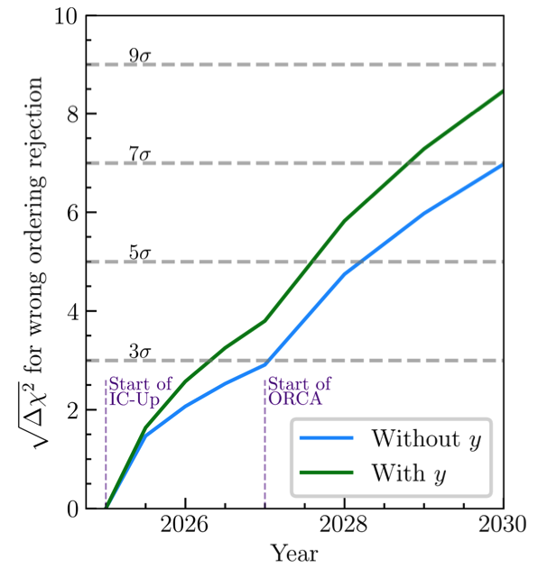
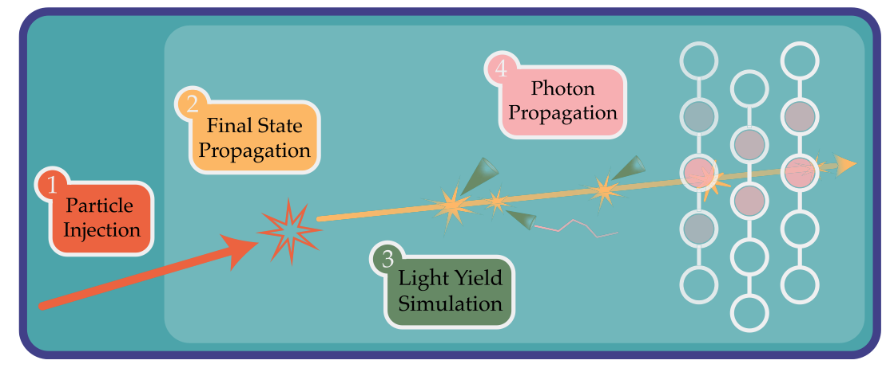
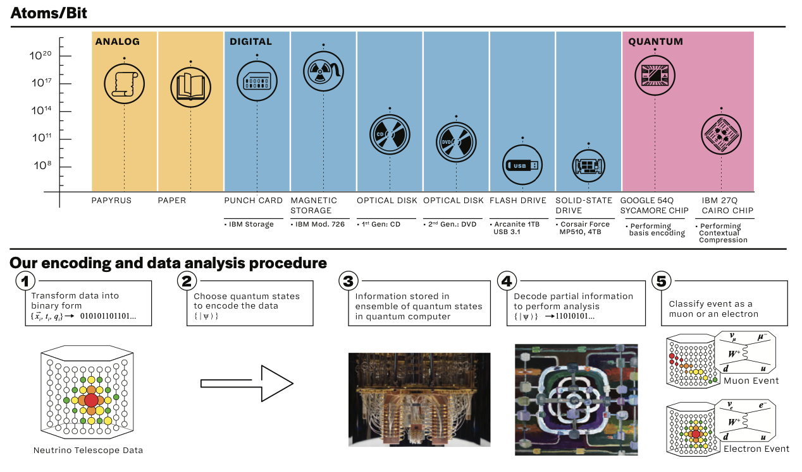

I am broadly interested in (astro)particle physics and cosmology, with the overarching goal of advancing our understanding of the fundamental laws of the universe. So far, in my undergraduate career, I worked toward this goal in the field of neutrino physics, under the guidance of Professor Carlos Argüelles-Delgado at Harvard University. Neutrinos are one of the most mysterious particles in our current gold-standard theory of elementary particle dynamics: the Standard Model. Many questions about neutrinos remain to be answered, ranging from precise measurements of their mass and other free parameters governing their interactions to whether or not there is a fourth flavor, the so-called sterile neutrino. As such, neutrinos offer tremendous opportunities for not only better determining parameters in the Standard Model but also shedding light on theories beyond the Standard Model (BSM). They have also been studied as potentially forming part of the dark matter (specifically the sterile neutrino) or coupling to a possible dark matter particle.

In particular, I have worked on projects involving:

<ul>
    <li>data analysis of atmospheric neutrino detection events;</li>
    <li>Monte Carlo simulations of atmospheric neutrino detections;</li>
    <li>quantum encoding algorithms of high-energy physics data.</li>
</ul>

## Data Analysis in IceCube
Main paper [here](https://journals.aps.org/prd/abstract/10.1103/PhysRevD.110.L051101).

{:style="text-align:center;"}
{:width="50%"}

IceCube is a Cherenkov neutrino detector located roughly a kilometer below the ice in Antarctica. It approximately a cubic kilometer of instrumented ice, containing 5160 digitcal optical modules (DOMs) that detect light. Since neutrinos only interact through the weak force and IceCube is equipped to detect electromagnetic radiation (light), then IceCube can only detect neutrinos indirectly, through remnants that they produce in their traversal through the ice. In particular, when neutrinos interact with the ice, they can release secondary charged particles that then emit Cherenkov radiation, for they travel faster than photons in ice. This light is then picked up by the DOMs, leaving a trace of the charged particle's trajectory.

Such Cherenkov neutrino detectors can only differentiate between neutrinos and antineutrinos on a statistical basis, i.e. they cannot distinguish whether one particular event has come from a neutrino or its antiparticle. Obtaining information on this distinction would help us in measuring atmospheric neutrino oscillation parameters such as the $$\Delta m^2_{31}$$ mass difference and the $$CP$$-violating phase, $$\delta_{CP}$$. In this work, we showed how including a kinematic variable known as the Bjorken-$$y$$ or inelasticity in the statistical analysis of detection events can greatly improve the sensitivity to the measurement of these parameters. We used simulation data from IceCube and the ORCA detector, which operates on the same principle as IceCube but in water instead of ice and which is currently under construction in the Mediterranean Sea. After including the inelasticity parameter, we obtained substantial improvements in the sensititivty to the neutrino mass ordering and the $$\Delta m^2_{31}$$ and $$\delta_{CP}$$ parameters.

## *Prometheus*: An Open-Source Neutrino Telescope Simulation
Main paper [here](https://doi.org/10.1016/j.cpc.2024.109298).
Code publicly available [here](https://github.com/Harvard-Neutrino/prometheus).

{:style="text-align:center;"}
{:width="80%"}

Here we present Prometheus, an open-source Python package that simulates particle detection events in Cherenkov neutrino telescopes deployed in ice or water. The code accepts any geometrical configuration of a detector, which consiuts of the arrangement of light detectors in the medium. Given such a geometry, Prometheus then simulates neutrino interactions in the volume surrounding the detector, computes the light yield of the hadronic shower and the out-going lepton, propagates the photons in the medium, and records their arrival times and position in user-defined regions.

## Quantum Encoding of High-Energy Physics Data
Main paper [here](https://arxiv.org/abs/2402.19306).

{:style="text-align:center;"}

As high-energy particle physics experiments continue to probe ever-increasing energies, there arises the problem of the most efficient storage method for the accompanying ever-increasing amounts of data. In this project, we implemented the first instance of a novel quantum compression algorithm for classical data that was proposed by [Gatti et al. (2021)](https://quantum-journal.org/papers/q-2023-01-13-895/), which can store exponentially larger amounts of data than classical methods. This encoding algorithm stores classical information (strings of 0s and 1s) in the spin correlation of qubits, and the inforrmation can be retrieved through measurements of the parity observables on these qubits. As a test of our implementation, we encoded neutrino telescope detection data that was simulated with [Prometheus](#prometheus-an-open-source-neutrino-telescope-simulation) on an IBM quantum computer. After measurement of the qubits, we successfuly retreived 84% of the original information.
